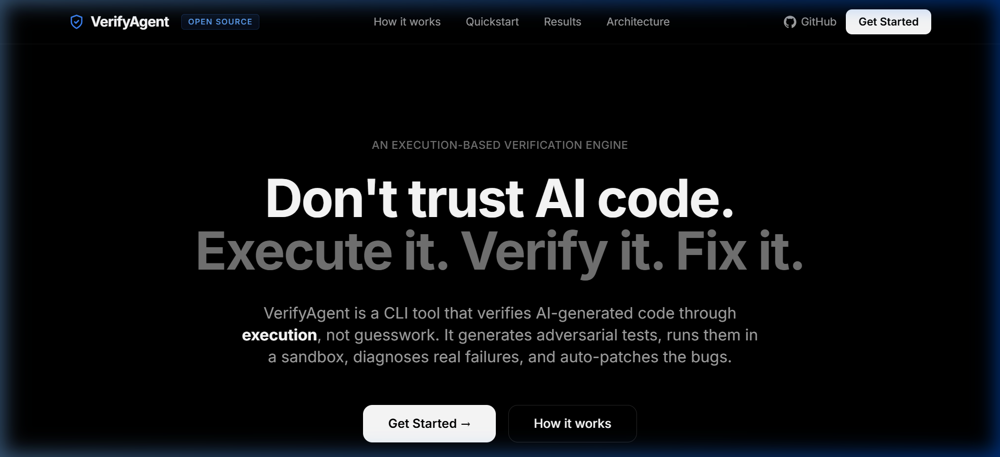

# VerifyAgent: The AI Code Verification Engine

> **The Verification Gap**: LLMs can write code in seconds, but real engineering begins when convincing code is not enough. Static AI reviewers (asking the AI "is this correct?") often hallucinate and miss critical runtime bugs.

**VerifyAgent** is a verification engine that forces AI-generated code to prove it works by **executing it**. It generates adversarial tests, runs them in an isolated sandbox, diagnoses the failures from tracebacks, and automatically applies self-healing patches.



## 01. The Problem & User Value

**Who has this problem?**
AI Software Engineers, Engineering Managers, and independent developers building tools with LLMs. As teams increasingly rely on AI to generate application logic, they encounter a major bottleneck: trusting the output.

**What bottleneck makes it worth solving?**
Currently, evaluating AI-generated code relies on either manual human review or "static" AI review (asking another LLM to review the code). Static review is highly unreliable—an LLM can read flawed logic, hallucinate that it is sound, and confidently pass it. It cannot predict how code handles edge cases, memory limits, or missing dependencies during runtime.

**Why is solving it valuable?**
Real engineering requires execution. By executing the code in a sandbox and diagnosing real tracebacks, we bridge the "Verification Gap". A developer can confidently merge AI code knowing it has already survived 12 adversarial, executed test cases.

## 02. The Solution & Engineering

VerifyAgent uses a **6-Phase Execution Pipeline** backed by the Gemini 3.6 Flash model:

1. **Understand**: Parses the AI-generated code and the specification.
2. **Generate**: Creates 12 adversarial test cases targeting common AI hallucinations (edge cases, off-by-one, type mismatches).
3. **Execute in Sandbox**: Runs the generated tests in a secure, isolated Python subprocess with strict timeouts.
4. **Diagnose**: Analyzes actual `stdout` and `stderr` tracebacks to pinpoint root causes of test failures.
5. **Fix**: Generates a patch based on the diagnosis and re-runs the tests (up to 2 retries).
6. **Report**: Outputs a structured JSON report, full agent trajectories, and the fixed code.

*Additionally, we built an **Agent-to-Agent REST API** (via FastAPI) so other AI tools can send unverified code payloads to VerifyAgent and receive verified, patched code in return.*

## 03. Improvement Changelog

Below is the evolution of VerifyAgent from a naive static reviewer to a fully sandboxed execution engine.

| Stage | What you tried and why | Evidence | Decision / Learning |
| :--- | :--- | :--- | :--- |
| **Baseline** | Created `run_baseline.py` using a single prompt asking the LLM to statically review code and find bugs. | Baseline missed critical off-by-one errors and hallucinated fixes that didn't run. False positive rate was very high. | **Learning:** LLMs cannot reliably execute code in their "head". We must use a real Python interpreter. |
| **Iteration 1** | Built `sandbox/runner.py` to run the code via `subprocess`. Generated simple tests to run against it. | Tests caught real crashes, but infinite loops caused the system to hang forever. | **Revised:** Added strict 5-second timeouts and memory limits to the sandbox execution. |
| **Iteration 2** | Passed the raw `stdout`/`stderr` back to the LLM to auto-fix the code. | The LLM sometimes broke the code further by guessing what failed. | **Revised:** Added a dedicated **Diagnosis Phase** to parse the traceback into a structured JSON root-cause analysis before attempting a fix. |
| **Final** | Combined Sandbox, AST Parsing, Diagnosis, and Retries into the 6-Phase Pipeline (`run_agent.py`), plus a REST API. | Perfect 12/12 pass rates across the benchmark. Tracebacks reliably guided the AI to perfect patches. | **Kept:** This is the core VerifyAgent product. |

## 04. How to Evaluate & Reproduce

We use **10 challenging AI-generated code cases** (located in `/data/cases/`) containing subtle logic bugs.
**Primary Metric:** The number of cases successfully patched to achieve a 12/12 passing test suite.

**A judge can easily reproduce this from a clean environment:**

### 1. Clean Setup
```bash
git clone https://github.com/AyoolaAdedeji/verifyagent.git
cd verifyagent
pip install -r requirements.txt
cp .env.example .env
# Edit .env and add your GEMINI_API_KEY
```

### 2. Run the Baseline (Static Review)
```bash
python run_baseline.py
# Runtime: ~10 seconds.
# Expected Output: A JSON report guessing at potential bugs.
```

### 3. Run VerifyAgent (The Solution)
```bash
python run_agent.py
# Runtime: ~10-15 minutes (due to strict API rate limits & retries). 
# Note: It automatically saves state. If it crashes, run it again to resume!
# Expected Output: Executes tests, prints tracebacks, and saves fixed code to /results/agent/.
# Cost: ~$0.02 to run the full 10-case benchmark.
```

### 4. Evaluate Final Results
```bash
python score_results.py
# Expected Output: Terminal output showing precision, recall, and pass rates.
```

### 5. Start the Agent REST API (Optional)
```bash
python server.py
# Spins up a FastAPI server on port 8000.
```

## 05. Hot Take / Insights

**Hot Take: Static AI code review is a dead end.** 
Building this project proved that asking an LLM "Is this code correct?" is practically useless for complex logic. An LLM acts like a junior developer too afraid to say "I don't know," so it hallucinates bugs that don't exist and misses the ones that do. **If an AI agent cannot execute the code it is reviewing, it is just guessing.** The future of AI software engineering is 100% execution-based verification. 

## Built With

- **Backend**: Python 3.13, `google-genai` SDK, FastAPI
- **Frontend**: Vite, HTML/CSS/JS/Tailwind
- **Model**: Google Gemini 3.6 Flash
- **Execution**: Native Python `subprocess` with timeouts

Built by Ayoola Adedeji (Founder of [STRATIFY-SYS](https://stratifysys.dev)) for the **micro1 Frontier Engineering Challenge 2026**.
